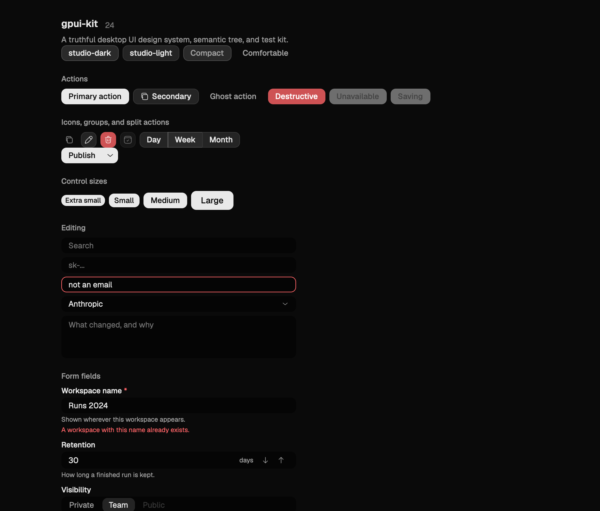
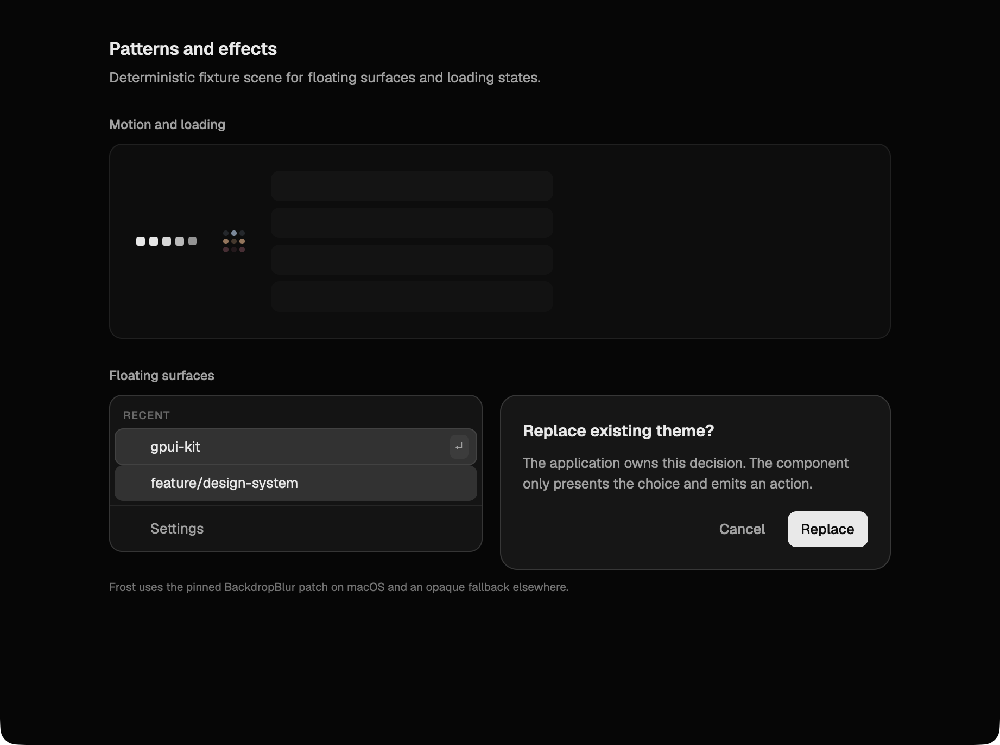

# gpui-kit

`gpui-kit` is a design system, component library, semantic automation layer,
and visual test kit for native desktop applications built with
[GPUI](https://github.com/zed-industries/zed).

**Website:** [gpui-kit.origingame.dev](https://gpui-kit.origingame.dev) ·
**MCP endpoint:** [`https://gpui-kit.origingame.dev/mcp`](https://gpui-kit.origingame.dev/mcp)

It extracts product-neutral lessons from a production Studio interface:

- one typed token authority instead of colors scattered through views;
- compact native-desktop components with complete interaction states;
- truthful async state that does not turn failures into empty or successful UI;
- host/view separation, where components read view models and emit actions;
- a per-frame semantic tree for native windows without a DOM;
- in-process window capture and deterministic visual fixtures.

The repository does **not** contain OriginGame, Forge, agent runtime, account,
project, thread, or workflow domain logic.

## Workspace

| Crate | Responsibility |
|---|---|
| `gpui-kit-tokens` | GPUI-independent token document, validation, and typed semantic access |
| `gpui-kit-theme` | The single Token → GPUI adapter and `Theme` global |
| `gpui-kit-assets` | Licensed Geist fonts and product-neutral SVG icons |
| `gpui-kit` | Components, motion, frost, edge fade, popovers, settings patterns, truthful state |
| `gpui-kit-semantics` | Per-frame semantic nodes measured during GPUI prepaint |
| `gpui-kit-testkit` | Semantic assertions, window capture, PNG output, and frame comparison |
| `gpui-kit-gallery` | Runnable component gallery and visual fixture |

## Depend on it

This library is not on crates.io and cannot be, because it depends on GPUI by
Git revision and a published crate may not. A consumer therefore pins a commit
of this repository:

```toml
[dependencies]
# One revision of this repository, for every crate you take from it.
gpui-kit = { git = "https://github.com/fran0220/gpui-kit", rev = "<commit>" }

# Your application writes GPUI views, so it depends on GPUI directly, and the
# URL and revision must match this workspace's exactly. Cargo treats a
# different revision as a different crate: two copies of GPUI in one binary
# means two sets of globals, and the theme and semantic registry this library
# installs would be invisible to your views.
gpui = { git = "https://github.com/fran0220/zed", rev = "b6755ec0ec370c8c69b4db7c065d0fa7a2cfb2b1" }
```

If the application names `gpui_platform` or `gpui_wgpu` too, give every GPUI
crate that same URL and revision. `cargo run -p xtask -- dependencies check`
enforces the equivalent rule across this repository's two workspaces,
lockfiles, and compatibility declarations.

Requires Rust 1.97 and edition 2024. macOS, Windows, and Linux are supported
platforms. The component catalog is visually regression-tested through native
window capture on macOS and deterministic offscreen WGPU rendering on Windows
and Linux; see [`docs/compatibility.md`](docs/compatibility.md) for the
platform-specific renderer and accessibility details.

That is usually all: `gpui-kit` re-exports the assets, theme, token and
semantics crates as `gpui_kit::{assets, theme, tokens, semantics}`, so an
application does not name them separately. `gpui-kit-testkit` is the exception —
add it to `[dev-dependencies]` from the same revision, with its `test-support`
feature, to get the render harness.

`gpui-kit`'s `fixtures` feature compiles the reference calendar the date scenes
run on. It is off by default and should stay off in an application: it exists so
the gallery and the tests have a calendar, not so a product has one.

## Quick start

Two things happen at boot, and they happen in different places. The icons are
SVG assets, so whatever builds your `Application` has to be given this crate's
asset source — GPUI takes that at construction and no later. Everything else is
one call:

```rust
use gpui_kit::prelude::*;

// This is what the gallery does, through GPUI's `gpui_platform` crate.
// Substitute whatever constructs your own Application; if it already has an
// asset source, delegate `icons/…` to this one.
let app = gpui_platform::application().with_assets(gpui_kit::assets::Assets);

app.run(|cx| {
    // Registers the embedded fonts, the theme global, the semantic registry
    // components publish into, and the globals and key bindings the text
    // controls, the drag system and the toasts need. Call it before opening
    // a window.
    gpui_kit::install(cx);
});
```

```rust
// In a view. Components read the theme from the context themselves.
let save = Button::new("settings.save")
    .label("Save")
    .primary()
    .disabled(saving)
    .on_click(move |window, cx| {
        controller.update(cx, |controller, cx| controller.save(window, cx));
    });
```

`Button` does not install its click handler while disabled. Disabled is
therefore behavior, not only opacity.

## What the host owns

A component holds hover, focus, open and animation state, and nothing else. The
value, the selection, the sort, the expansion and the answer belong to the
caller, which is why every one of them reports an intent instead of applying it:
a change the host refuses is visible as the control not moving. Where a
component needs a fact it cannot hold — what day it is, what a month is called,
whether a message was really read — it takes a host-supplied reader for that
fact, and a reader that answers "I don't know" is answering.

So a host owns its data, its transports and its refusals, and this library owns
what is drawn and what is reported.
[`docs/host-view-boundary.md`](docs/host-view-boundary.md) is the contract;
[`docs/truthful-ui.md`](docs/truthful-ui.md) is why loading, empty, unstarted,
unavailable and failed stay distinct;
[`docs/coverage.md`](docs/coverage.md) is what this library will not do at all.

## Run the gallery

```bash
cargo run -p gpui-kit-gallery
```

Capture the gallery's own window on macOS:

```bash
cargo run -p gpui-kit-gallery -- \
  --density=compact --capture snapshots/macos/gallery.png
```

This uses the owning process and window id. It does not capture the desktop.

### Gallery





## Tokens

`crates/gpui-kit-tokens/tokens/studio-dark.json` and its light counterpart are
the source of truth, and they live inside the crate that reads them so that
crate is publishable on its own. Views consume semantic roles through
`gpui-kit-tokens` and
`gpui-kit-theme`, and switch at runtime:

```rust
gpui_kit::theme::activate_theme("studio-light", cx);
gpui_kit::theme::set_density(Density::Compact, cx);
```

```bash
cargo run -p xtask -- tokens generate
cargo run -p xtask -- tokens check
```

The first command updates `docs/token-reference.md`; the second fails if that
generated reference has drifted or if a theme falls below its contrast floor.

### Provide your own theme

A theme is a token document, and an application registers one at boot. Every
theme carries the same key set, so a document that omits a key is rejected
rather than silently defaulted:

```rust
use gpui_kit::theme::ThemeRegistry;

cx.update_global::<ThemeRegistry, _>(|registry, _| {
    registry.register_json(include_str!("../themes/acme-dark.json"))
})?;
gpui_kit::theme::activate_theme("acme-dark", cx);
```

Registering an id that already exists replaces that document, so an application
can override a bundled theme without shadowing it. `activate_theme` returns
`false` for an id nobody registered and leaves the active theme where it was.
[`docs/token-model.md`](docs/token-model.md) describes the key set;
`docs/token-reference.md` is generated from it.

## Test through the semantic tree

Every user-visible action and assertion target has a stable semantic id derived
from business identity rather than list position, and the tree is measured
during prepaint, so a test reads what a frame actually published. Add
`gpui-kit-testkit` with its `test-support` feature to `[dev-dependencies]` and
drive a window with `Harness`, which offers `click`, `keystrokes`, a simulated
pointer and drag, and a frame driver on a simulated clock.
[`docs/semantic-automation.md`](docs/semantic-automation.md) is the contract for
what a node reports; [`docs/screenshot-testing.md`](docs/screenshot-testing.md)
covers window capture and what a screenshot does and does not prove.

## Versioning and compatibility

This library is not published to crates.io and will not be while GPUI is a Git
dependency: a crates.io release may not depend on a Git revision. That decides
everything below.

**What you pin is a revision.** `rev = "<commit>"` of this repository is the
unit of consumption, and a release tag is a commit somebody has stated is worth
pinning rather than a different kind of artifact — `rev = "v0.2.0"` and the
commit it names are the same thing to Cargo. `version` in each `Cargo.toml` is
what Cargo requires a manifest to carry; it is not a version anybody can
resolve against. Do not use `branch = "main"`: a floating branch means an
unannounced upgrade, and the same rule applies here as to the GPUI pin.
[`docs/releasing.md`](docs/releasing.md) describes how a tag is cut and what it
promises.

**What a breaking change means here.** Nothing enforces semver, so the promise
has to be stated rather than inferred from a number. Three things are
load-bearing for a consumer, and only one of them is visible to the Rust
compiler:

- **The Rust API.** Builders, traits, events, and the prelude. A change here
  fails your build, which is the honest kind of break.
- **Token keys.** `crates/gpui-kit-tokens/tokens/*.json` is a schema. A key that
  is renamed or removed
  breaks any theme document an application maintains, and that document is only
  validated at runtime — `register_json` returns an error, and the application
  starts with no theme rather than the wrong one. Treat a token key rename as a
  breaking change.
- **Semantic ids.** A downstream test asserts on ids such as
  `settings.save`. Renaming one breaks that test and nothing in Rust's type
  system says so. Treat a semantic id rename as a breaking change, on the same
  footing as removing a public method.

Scene snapshots under `snapshots/` are this repository's own evidence, not an
interface. They change whenever a component's appearance legitimately changes,
and a consumer should not compare against them; capture your own application's
windows instead.

**Upgrading.** Read `CHANGELOG.md` between the commit you are on and the one you
are moving to; entries state what a component now does and what it refuses to
do. [`docs/migration-guide.md`](docs/migration-guide.md) covers the moves that
need more than a line. When this workspace changes its GPUI revision, your
application has to change it in the same commit, because the two have to match
exactly.

## The catalog, without a checkout

<https://gpui-kit.origingame.dev> is every component with its exact
signatures, every scene with the code that drew it, and both captured themes.
The same address serves an MCP endpoint at `/mcp`, so an agent can search the
catalog, read a signature and look at a component in one call each. It is one
Cloudflare Worker over static assets and needs no server, because the scene set
is fixed and its captures are deterministic — see
[`docs/deploying.md`](docs/deploying.md).

## Roadmap

### Next: complete Web support

The next milestone is to support browser-hosted GPUI applications without
forking the component API into a separate web-only library. That work includes
the upstream GPUI rendering, input and accessibility primitives the browser
needs, reuse of the same tokens and themes, semantic automation, and a
deterministic browser visual gate. Native desktop support remains in place;
web support will be claimed when rendering, interaction, accessibility and
visual regression coverage pass together rather than when components merely
compile for a web target. The product-neutral browser gallery now builds on
stable Rust and its representative rendering, interaction, accessibility, and
visual smokes pass; the full catalog baseline is still pending. See
[`docs/compatibility.md`](docs/compatibility.md).

The browser host under `examples/browser-gallery` renders the canonical Rust
scene catalog directly. It is not a second DOM component implementation and
does not by itself make a complete Web support claim.

## Validation

```bash
cargo run -p xtask -- dependencies check # one immutable Zed source everywhere
cargo run -p xtask -- gate        # dependencies, fmt, check, test, clippy, generated artifacts
cargo run -p xtask -- gate full   # the above, plus rustdoc and scene images
cargo run -p xtask -- headless check # deterministic Linux/Windows visual gate
cargo run -p xtask -- web smoke      # real Chromium interaction/backend/a11y smoke
cargo run -p xtask -- web visual check button input dialog node-graph
```

The scene images are the visual regression gate:

```bash
cargo run -p xtask -- scenes check
```

CI runs the non-visual gate and the software-rendered headless visual gate on
Linux and Windows. The native macOS capture needs a composited, frontmost
window and the display the baselines came from, which a GitHub-hosted runner
does not give, so it runs on a self-hosted runner where one is configured and
is otherwise a step a reviewer performs and records.
[`docs/screenshot-testing.md`](docs/screenshot-testing.md) states what it
requires and why a job that ran it anyway would be worse than no job.

## GPUI compatibility

The workspace pins the `fran0220/zed` integration fork at
`b6755ec0ec370c8c69b4db7c065d0fa7a2cfb2b1`. It combines the runtime
primitives and native-surface work with the offscreen WGPU renderer and the
Windows pointer-exit lifecycle correction, plus pointer capture that survives
gesture redraws, and the browser renderer/input/accessibility integration on
one immutable revision. WGPU 29.0.4 and gpu-allocator
0.28.0 resolve from crates.io rather than integration forks; reusable pieces
can be proposed upstream independently. See
[`docs/compatibility.md`](docs/compatibility.md).

## Documentation

- [Changelog](CHANGELOG.md)
- [Coverage: what is here, what is refused, what is missing](docs/coverage.md)
- [Design principles](docs/design-principles.md)
- [Token model](docs/token-model.md)
- [Components](docs/components.md)
- [Component contracts](docs/component-contracts.md)
- [Truthful UI](docs/truthful-ui.md)
- [Host/view boundary](docs/host-view-boundary.md)
- [Semantic automation](docs/semantic-automation.md)
- [Screenshot testing](docs/screenshot-testing.md)
- [Accessibility and platform capability matrix](docs/accessibility.md)
- [GPUI recipes](docs/gpui-recipes.md)
- [Motion](docs/motion.md)
- [Drag and drop](docs/interaction.md)
- [Date and time](docs/datetime.md)
- [Markdown and conversation](docs/content.md)
- [Migration guide](docs/migration-guide.md)
- [Agent Skill](skills/building-gpui-product-ui/SKILL.md)

## License

The repository code is MIT licensed. Included and derived third-party material
retains its original license and attribution. See
[`THIRD_PARTY_NOTICES`](THIRD_PARTY_NOTICES) and
[`PROVENANCE.md`](PROVENANCE.md).
